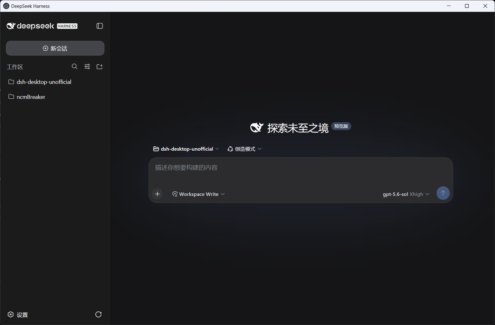
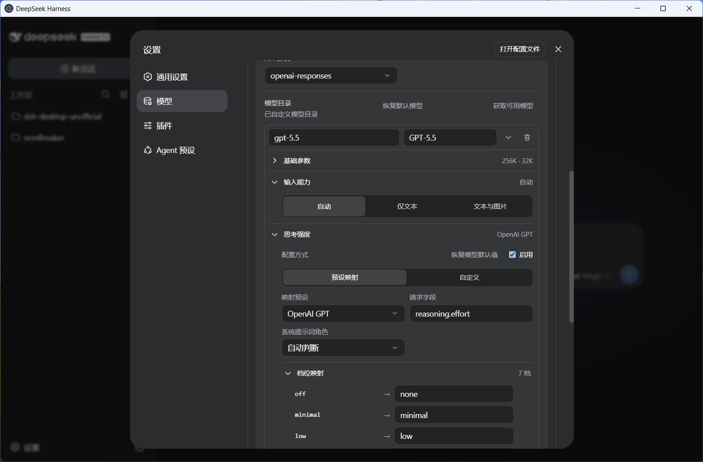
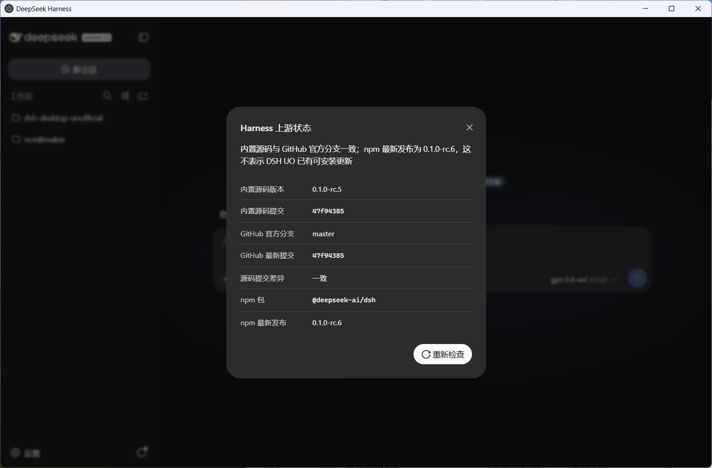

# DSH UO

English | [简体中文](README.md)

[](https://github.com/KaffuAlcaid/dsh-desktop-unofficial/actions/workflows/ci.yml)
[](https://github.com/KaffuAlcaid/dsh-desktop-unofficial/releases/latest)
[](LICENSE)

## Overview

DSH UO is an unofficial desktop distribution of [DeepSeek Harness](https://github.com/deepseek-ai/deepseek-harness). Release packages bundle the Harness Web UI, a pinned Harness source revision, and the Node.js runtime so that the application can be used as an installed desktop program.

DSH UO also adds interfaces for model input capabilities, reasoning effort, system-prompt editing, and Harness upstream status. DSH UO is an early preview, and the upstream Harness project is in developer preview. Future versions may contain breaking changes. This project is independently maintained and is not an official DeepSeek desktop client.

## Screenshots



Model input capabilities and reasoning-effort settings:



Harness upstream status:



## Download

Most users should download a package from [GitHub Releases](https://github.com/KaffuAlcaid/dsh-desktop-unofficial/releases/latest); building from source is not required. The automatically generated `Source code (zip)` and `Source code (tar.gz)` archives on the Releases page contain only the project source and cannot be launched as the desktop application.

| Platform | Package | Intended use |
| --- | --- | --- |
| Windows x64 | `DSH-UO-Setup-<version>-x64.exe` | Recommended; installs the application and creates shortcuts |
| Windows x64 | `DSH-UO-<version>-win-x64.zip` | No-install archive; fully extract it before running |
| Linux x64 | `DSH-UO-<version>-linux-x86_64.AppImage` | Recommended Linux package |
| Linux x64 | `DSH-UO-<version>-linux-x64.zip` | Extracted application directory |

GitHub Releases may be slow or inaccessible on some networks in mainland China. The project currently has no official domestic mirror or alternative download site, so GitHub Releases is the only official publication source. Do not download the application from an unknown file-sharing site, proxy, or repackaging page.

No macOS, ARM64, `.deb`, or `.rpm` package is currently published.

## Windows Installation and Unsigned Packages

For the installer, run `DSH-UO-Setup-<version>-x64.exe`, approve the administrator prompt, and choose the installation directory. After installation, start DSH UO from its desktop or Start menu shortcut.

For the ZIP package, fully extract the archive to a normal directory and run `DSH-Desktop-Unofficial.exe` from that directory. Do not run it from an archive preview or copy only the EXE. The ZIP avoids installation, but settings, credentials, and sessions remain in the Windows application-data directory and do not move with the program directory.

The current Windows installer and executable are not code-signed. Windows may therefore show an unknown-publisher warning, and Microsoft Defender SmartScreen may block the first launch. Continue only after confirming that the file came from this repository's GitHub Releases page. In the SmartScreen dialog, select **More info**, then **Run anyway**. The exact wording may differ between Windows versions.

If the source is uncertain or the filename does not match an asset listed on the Releases page, cancel the launch and download it again from the official Releases page. You do not need to disable SmartScreen or other Windows security features.

## Linux Installation

The current Linux release uses XWayland by default to avoid GPU-process crashes seen with some NVIDIA drivers.

Run the AppImage:

```bash
chmod +x DSH-UO-<version>-linux-x86_64.AppImage
./DSH-UO-<version>-linux-x86_64.AppImage
```

Or extract and run the ZIP package:

```bash
mkdir dsh-uo
unzip DSH-UO-<version>-linux-x64.zip -d dsh-uo
./dsh-uo/dsh-uo
```

Native Wayland is experimental. To opt in explicitly:

```bash
./DSH-UO-<version>-linux-x86_64.AppImage --ozone-platform=wayland
```

Some NVIDIA drivers may repeatedly crash the GPU process in this mode.

## First Use

1. Open **Settings → Models**, select a model provider, enter its API key, and save it. Change the API endpoint and model catalog when needed.
2. Select a workspace on the main screen, add a directory that the Agent may access, and select it. The session composer remains unavailable until a workspace is selected.
3. Select an Agent preset. New users can keep the default **Standard** preset.
4. Start a session, select a configured model, and send a concrete task such as `Summarize this repository and identify its main packages.`
5. Review approval prompts before allowing file changes or command execution. Harness Agents can read and edit files and run commands inside the selected workspace.

See the upstream [Web UI guide](https://github.com/deepseek-ai/deepseek-harness/blob/master/docs/user/guide/index.md) and [model configuration guide](https://github.com/deepseek-ai/deepseek-harness/blob/master/docs/user/guide/providers.md) for the underlying Harness workflow.

## DSH UO Additions

- [Model input capabilities](harness-overrides/packages/client/ui-dsh-uo-model-input/README.md): choose automatic, text-only, or text-and-image input for each model.
- [Reasoning effort](harness-overrides/packages/client/ui-dsh-uo-reasoning-effort/README.md): provider presets, custom effort mappings, thinking formats, and prompt-role selection.
- [System-prompt editor](harness-overrides/packages/client/ui-dsh-uo-system-prompt/README.md): create a user Agent preset from Standard and edit its persona system prompt. Saved changes apply to subsequently created sessions.
- [Harness upstream status](harness-overrides/packages/client/ui-dsh-uo-upstream-status/README.md): shows the bundled Harness commit, official repository movement, and latest npm version in the desktop sidebar. It reports information only and does not download or install updates.

These controls use existing Harness and pi-ai configuration formats. Follow the linked documentation for detailed behavior and limitations.

## Updates

DSH UO has no automatic updater. Installable updates are published only through this repository's [GitHub Releases](https://github.com/KaffuAlcaid/dsh-desktop-unofficial/releases) and must be downloaded and installed manually.

The upstream-status action presents the Harness source revision bundled by DSH UO, movement on the official GitHub default branch, and the npm `latest` version of `@deepseek-ai/dsh`. A newer GitHub commit or npm version indicates an upstream change, but it does not mean that a compatible DSH UO package is available. DSH UO remains pinned until the change has been reviewed, adapted, and released as a new desktop package.

## Data and Logs

The Windows ZIP stores Harness settings, credentials, and sessions under `data/dsh-home` beside the extracted application, with the default workspace under `data/workspace`. On first launch, when those portable directories do not exist, the application detects the Electron user-data directory for `DSH Desktop Unofficial` and copies any existing `dsh-home` and `workspace`; the AppData originals remain untouched, and later launches use only the portable directories. The NSIS installation continues to use the operating system's Electron user-data directory.

Desktop and Harness process output is written to:

```text
Windows ZIP: <extracted directory>/data/logs/dsh-desktop.log
NSIS installation: <system Documents directory>/DSH-UO/logs/dsh-desktop.log
```

When startup fails, the error screen shows the resolved log path.

## Known Limitations

- Windows and Linux x64 are the only packaged targets.
- Windows release packages are currently unsigned, so the first launch may show an unknown-publisher or SmartScreen warning.
- Application updates require a manual download from GitHub Releases.
- Linux requires XWayland by default; native Wayland remains experimental.
- Harness and DSH UO are preview software and may introduce incompatible changes.
- Upstream compatibility is tied to the repository and full commit recorded in [`upstream/harness.json`](upstream/harness.json).

## Development Documentation

Packaged users do not need the following build steps. To modify or package the project, start from the repository root and see:

- [Build and develop from source](docs/building.md)
- [Maintainer release procedure](docs/releasing.md)
- [Harness override architecture](harness-overrides/README.md)

## Support

Use [this repository's issues](https://github.com/KaffuAlcaid/dsh-desktop-unofficial/issues) for desktop packaging and DSH UO additions. Use the upstream [DeepSeek Harness discussions](https://github.com/deepseek-ai/deepseek-harness/discussions) for questions that also reproduce in the official Harness project.

## License

DSH UO is licensed under the [MIT License](LICENSE). DeepSeek Harness and bundled third-party components retain their own copyright notices and license terms.
